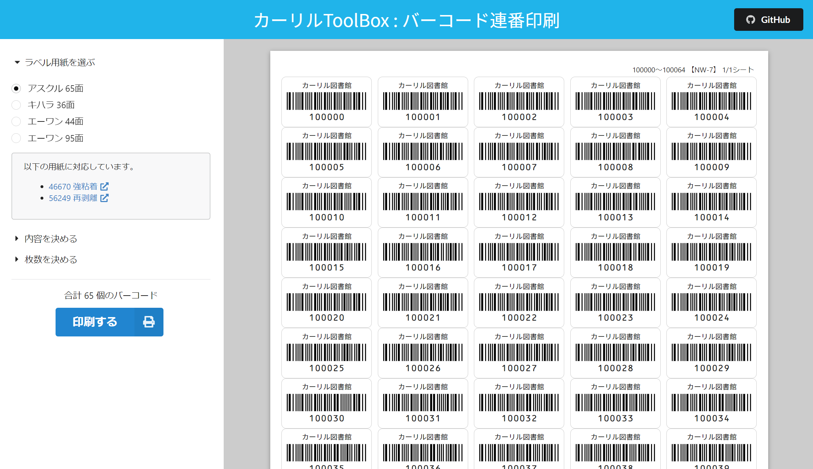

ajime
================
蔵書管理用のバーコード連番印刷ツール

https://barcode.calil.dev/

### コンセプト

- 蔵書管理用のバーコードをブラウザで印刷する
- 図書館でよくつかわれるラベル用紙に対応
- NW-7 / CODE39 / チェックデジット / ゼロ埋めをサポート
- 外部URLからパラメータを受け取ることができる（連携API）



### テンプレートの追加

`/src/templates/`以下にJSONファイルを追加して`/src/templates/index.ts`にファイルを追記することでラベル用紙のテンプレートを追加することができます。

### 開始番号

開始番号の設定は以下の書式によって詳細な指定が可能です

|  機能名  |  設定方法  |
| ---- | ---- |
|  チェックデジット（M10W21）  |  末尾にCを記述  |
|  アルファベットプレフィックス  |  先頭にアルファベットを記述（バーコードタイプがCODE39に変更される）  |
|  ゼロ埋め  | 先頭に0を記述・桁数も0で調整 |

### 連携API

以下のようなURLでパラメータを受け取ることができます。省略した場合は、ブラウザに保存されている前回に設定値が適用されます。初回アクセスの場合はデフォルト値が適用されます。このURLは長期的にサポートするためウェブサービスやシステムに組み込んでご利用いただけます。サポートを終了する場合は少なくとも1年前には案内します。

`https://barcode.calil.dev/#param1=xx&param2=xx`

|  パラメータ  |  内容  |
| ---- | ---- |
|  template  |  テンプレートID  |
|  library  |  図書館名（ラベル上部に印刷）  |
|  start  |  開始番号  |
|  sheet  |  印刷枚数  |
|  noheader | `true`を指定するとヘッダーを非表示にする [サンプル](https://barcode.calil.dev/#noheader=true) |
|  print | `true`を指定すると印刷ダイアログを表示する  [サンプル](https://barcode.calil.dev/#print=true)  |

### 管理バーコードの仕様

- 数字のみのバーコードはNW-7（Codabar）と呼ばれるバーコード規格で印刷します。この規格は図書館ではもっとも一般的なバーコードです。
- `BB000001`のように先頭にアルファベットが含まれる場合はCODE39と呼ばれる規格で印刷します。この規格は大学図書館などで使われることがあります。
- NW-7（Codabar）はスタート・ストップキャラクタを`A`に固定しています。バーコードリーダーの設定によっては読み込んだとき`A000001A`のように両端に`A`が付加される場合があります。バーコードリーダーの設定によってはスタート・ストップキャラクタを出力しないように設定できます。Excelなどでバーコードを扱う場合は、スタート・ストップキャラクタを含んだまま扱っても構いません。
- チェックデジットはバーコードの読み取り精度を向上するために歴史的に使われてきたものです。現在では、バーコードリーダーの性能が向上しており不要ですが、互換性のために必要な場合は追加できます。現在対応しているチェックデジットは「モジュラス10 ウェイト2・1分割」です。このチェックデジットは日本の公共図書館でもっとも普及しています。

### 開発

```
npm install
npm run start
```

### リリースビルド

```
npm run build
```

### ライセンス

[MIT](LICENSE)